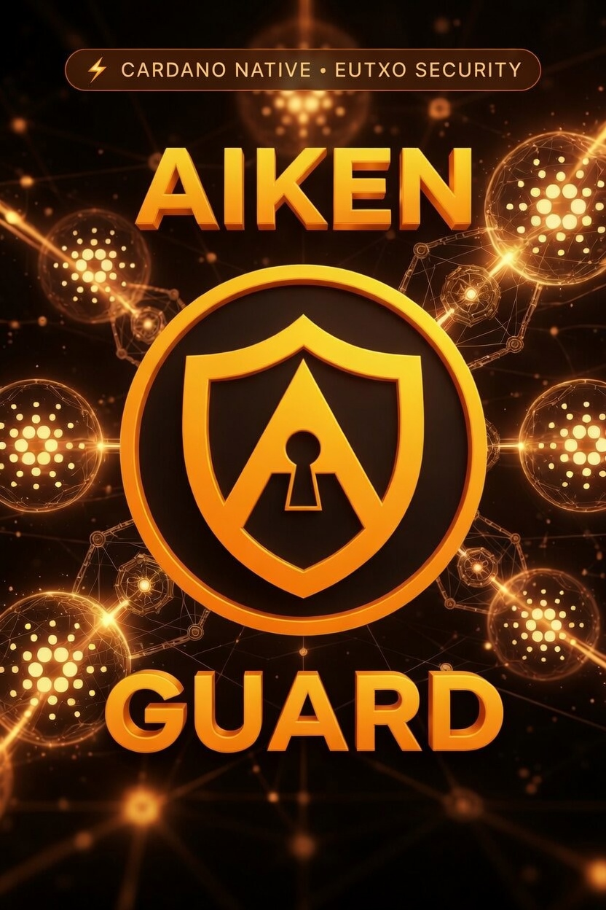

<p align="center">
  
</p>

<h1 align="center">AikenGuard v0.5</h1>
<h3 align="center">Automated Security Audits for Aiken Smart Contracts on Cardano</h3>

<p align="center">
  <a href="https://aikenguard.io"></a>
  <a href="https://github.com/vacuumlabs/cardano-ctf"></a>
  
  
</p>

---

## 🔥 Firestarter for the Cardano Community

We help Cardano developers write better contracts **before** going to a human auditor. When every developer cleans up as many flaws as possible, the whole community becomes stronger and more secure.

> *"A single undetected vulnerability can lock funds permanently on-chain."*

---

## What is AikenGuard?

AikenGuard is a two-layer automated security analysis tool for Aiken smart contracts on Cardano:

- **Layer 1** — 21 static detectors covering eUTxO-specific vulnerabilities
- **Layer 2** — AI deep analysis via Groq qwen3-32b + RAG from Vacuumlabs CTF, Aikido, and Aiken stdlib

Submit your `.ak` files → Pay in ADA → Receive your CIP-0052 report by email in seconds.

---

## Features

- **21 Security & Quality Detectors** — AK-001 to AK-021
- **100% CTF Detection Rate** — 26/26 Vacuumlabs CTF challenges detected
- **AI Deep Analysis** — Groq qwen3-32b with Cardano knowledge base
- **Multi-Contract Risk Detection** — Cross-validator interaction risks
- **CIP-0052 Compliant Reports** — Industry standard for Cardano audits
- **Native ADA Payments** — No credit card, no account required
- **Multilingual** — English, French, Spanish

---

## How It Works

```
1. Upload your .ak files at aikenguard.io
2. Choose your plan and send ADA to the wallet address
3. Blockfrost detects the payment automatically
4. AikenGuard runs Layer 1 + Layer 2 analysis
5. Receive your PDF report by email in seconds
```

---

## Pricing

| Plan | Price | Analysis |
|------|-------|----------|
| 🔥 Beta | 10 ADA | Full audit — Layer 1 + AI (1 month only) |
| Starter | 79 ADA | Layer 1 static analysis |
| Pro | 179 ADA | Layer 1 + AI deep analysis |
| Certified | 279 ADA | Layer 1 + AI + on-chain NFT certificate |

---

## Security Detectors

### Security Rules (AK-001 to AK-016)
- **AK-001** CRITICAL — Multiple satisfaction (eUTxO uniqueness)
- **AK-002** CRITICAL — Untyped datum (generic Data type)
- **AK-006** MEDIUM — trace() in production code
- **AK-007** MEDIUM — Reachable todo()/fail()
- **AK-008** MEDIUM — Time constraint without valid_range
- **AK-009** LOW — Ignored function parameter
- **AK-011** CRITICAL — Double satisfaction via list.find
- **AK-012** HIGH — Datum not persisted in continuing output
- **AK-013** HIGH — Revoke without extra_signatories check
- **AK-014** HIGH — Temporal verification on upper_bound
- **AK-015** HIGH — Vesting without beneficiary verification
- **AK-016** HIGH — Datum owner not verified against external source

### Quality Rules (AK-017 to AK-021)
- **AK-017** LOW — Validator without documentation
- **AK-018** LOW — expect without error message
- **AK-020** MEDIUM — Overly complex validator logic
- **AK-021** MEDIUM — Incomplete pattern match

---

## CTF Validation

AikenGuard has been validated against the [Vacuumlabs Cardano CTF](https://github.com/vacuumlabs/cardano-ctf):

```
✅ 26/26 challenges detected — 100% detection rate
```

---

## Sample Report

📄 [Download Sample Report](AikenGuard_Sample_Report.pdf)

📚 [Quality Standards Guide](QUALITY_GUIDE.md)

---

## Tech Stack

- **Layer 1** — Python regex static analysis
- **Layer 2** — [Groq API](https://groq.com) with qwen3-32b
- **RAG** — ChromaDB + sentence-transformers + Vacuumlabs CTF + Aikido
- **API** — FastAPI + Uvicorn
- **Email** — Resend
- **Payments** — Blockfrost webhooks
- **Infrastructure** — OVH Beauharnois, Canada 🇨🇦

---

## Built By

[Kipepeo Wallet](https://github.com/KipepeoWallet) — A sovereign mobile wallet for Africa, built on Cardano.

---

## Links

- 🌐 [aikenguard.io](https://aikenguard.io)
- 📧 [audit@aikenguard.io](mailto:audit@aikenguard.io)
- 🐦 Twitter: [@AikenGuard](https://twitter.com/AikenGuard)
- 📚 [CIP-0052](https://github.com/cardano-foundation/CIPs/tree/master/CIP-0052)
- 🏆 [Vacuumlabs CTF](https://github.com/vacuumlabs/cardano-ctf)

---

<p align="center">
  <em>Applying Cardano community standards, not inventing them.</em><br>
  <em>© 2026 AikenGuard · OVH Beauharnois, Canada · SSL Secured</em>
</p>
